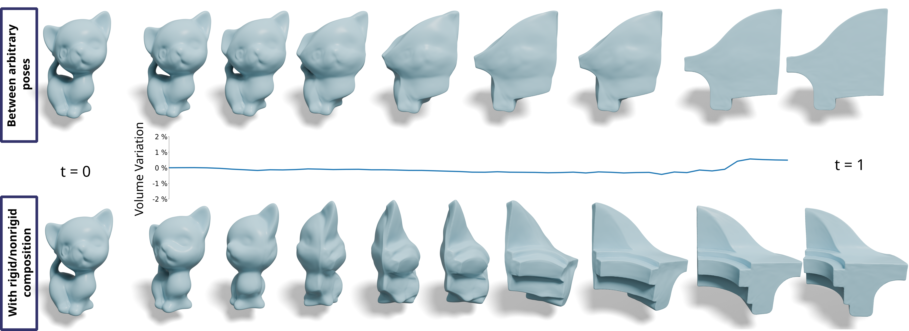
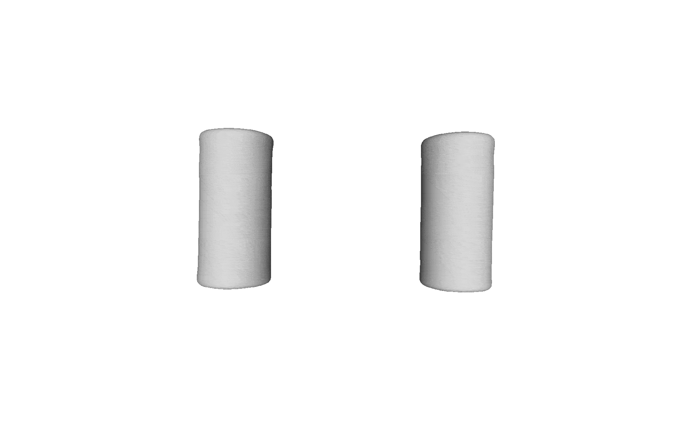

# Implicit-flow

This repository provides the code to reproduce the results in *Volume Preserving Neural Shape Morphing*, Camille Buonomo, Julie Digne, Raphaëlle Chaine, Symposium on Geometry Processing 2025 (Computer Graphics Forum).




## Clone
```
git clone https://github.com/camillebnm/neural_shape_morphing.git
```
## Installation
```
cd neural_shape_morphing
conda env create -f environment.yml
conda activate impl-flow
```

## TLDR

Minimum example (after installation and activation)
```
python morph-train.py experiments/morph_cylinder-torus.yaml -p ADADIV
python reconstruct.py results/morph_cylinder-torus_ADADIV/models/best.pth results/morph_cylinder-torus_ADADIV/ -t linspace 24 -r 256
```
The outputted files are standard .ply files in the folder `results/morph_cylinder-torus_ADADIV/` and can be visualized by any standard software such as meshlab, blender, paraview ...

## Code organization
This code is built upon the code given by the authors of [Neural Implicit Surface Evolution using Differential Equations](https://arxiv.org/abs/2201.09636). Their code is available [here](https://dsilvavinicius.github.io/nise/). It follows roughly the same architecture:


The common code is contained in the `src` folder:
* `dataset.py` - contains the sampling and data classes
* `diff_operators.py` - implements differential operators (gradient, hessian, jacobian, curvatures)
* `loss.py` - contains loss functions for different experimental settings
* `meshing.py` - creates meshes through marching cubes
* `model.py` - contains the networks and layers implementation
* `util.py` - contains miscelaneous functions and utilities

The main training and reconstruction scripts are in the root folder:
* `morph-train.py` - trains an interpolation between two neural implicit SDFs 
* `reconstruct.py` - given a trained model (pth) reconstructs the mesh using marching cubes at values `t` given by the user
* `sdf_train.py` - trains an a neural implicit SDF from a mesh

Other folders are organised as follow : 
* `results/` - contains the results of each experiment 
* `pretrained/` - contains our trained morphing networks
* `experiments/` - contains the configuration files (yaml) to run predefined experiments
* `ni/` - contains the neurals SDF of the test shapes 
* `data/` - contains the meshes of the test shapes

## Run an experiment

Given a proper configuration file (see folder `experiments/`), an experiment can be run as follows
```
python morph-train.py experiments/<configuration_file.yaml> -p <xp>
```
The <xp> parameter can be  : 
* `ADADIV` to run our method,
* `NULLDIV` to run the baseline with a fully divergence free vector field
* `FreeV` to run the baseline with an unscontrained vector field
* `nise` to run [nise](https://arxiv.org/abs/2201.09636) implementation
* `LF-INSD` to run our landmark-free implementation of [INSD](https://github.com/Sangluisme/Implicit-surf-Deformation)
* `lipschitz` to run the [LipMLP](https://github.com/ml-for-gp/jaxgptoolbox/tree/main/demos/lipschitz_mlp) implementation

Practical example : 

```
python morph-train.py experiments/morph_cylinder-torus.yaml -p ADADIV
```
## Reconstruct from a model

To reconstruct meshes from the implicit representation, you can use the file `reconstruct.py` as follows: 
```
python reconstruct.py <path_to_model.pth> <path_to_save_folder> -t <time_range> -r <marching_cube_grid_resolution>
```
The parameter `-t` has 3 uses : 
* `-t <list_of_float>` : `-t -1. 0. 1.` reconstructs the surface at specified times
* `-t linspace <int>` : `-t linspace 24` reconstructs the surface for each time in `torch.linspace(0,1,<int>)`
* `-t None` : reconstruct a surface when the model corresponds to the SDF of a single static shape.

The SIREN frequency of the model we want to reconstruct must be specified by `--omega0 <Freq>`. The default value is 1. 

Practical example :

```
python reconstruct.py results/morph_cylinder-torus_ADADIV/models/best.pth results/morph_cylinder-torus_ADADIV/ -t linspace 24 -r 256
```
The reconstructed outputs can then be viewed in (e.g.) meshlab with the command : 
```
meshlab results/morph_cylinder-torus_ADADIV/time*
```
    

    
## Volume change

Divergence-Free based method must perform interpolation between shapes of same volume. Our code contains an automatic rescaling (for those methods) of the biggest shape to match the volume of the smallest one as described in section 7.4 of our paper. You can also choose to manually change the scale of the smallest shape by using the parameter `--scale <float>` of `morph-train.py` : 

```
python morph-train.py experiments/morph_cylinder-tore.yaml -p ADADIV --scale <float>
```
    
 To reconstruct an interpolation with volume scaling, use the parameter `--scale <float1> <float2>` of `reconstruct.py`. The parameter contains 2 floats corresponding to the scaling factor of each shape. If one of the values is negative, the scaling factor will be the inverse of the absolute value of the float. The scaling is by default linear in time and can be changed by modifying the method `scaling(t)` in `meshing.py`
    
Example (Fig 13 in our paper) : 
```
python reconstruct.py pretrained/morph_sub_m-hiboux_ADADIV/models/best.pth results/morph_sub_m-hiboux_ADADIV/ -t linspace 24 -r 256 --scale -3 1
``` 
  
Be careful to train your neural representation on a domain sufficiently large to avoid artifacts in the training domain (or to use scaling factors close to 1).
    
## Use custom shapes 
If you want to use your own shapes, you must provide the following : 
* An explicit representation of the shape as a mesh or point cloud with normals `<oriented_mesh>.ply`, see folder 'data/' for example meshes.
* An implicit representation of the shape as a SIREN network. 
    
If you only have one of these representations, you can either : 
* Use the file `sdf_train.py` to learn an implicit neuronal SDF from a given mesh stored as an `<oriented_mesh>.ply` : 
    
```
python sdf_train.py --mesh <path_to_mesh.ply> --save <path_to_save>
```
* Use the file `reconstruct.py` to obtain an oriented mesh from an implicit neuronal SDF with SIREN achitecture with the parameter `-t None`


## Related work

- NISE [Neural Implicit Surface Evolution using Differential Equations](https://arxiv.org/abs/2201.09636) [github repo](https://dsilvavinicius.github.io/nise/)
- INSD [Implicit Neural Surface Deformation with Explicit Velocity Fields](https://openreview.net/forum?id=sYAFiHP6qr) [github repo](https://github.com/Sangluisme/Implicit-surf-Deformation)
- SIREN [Implicit Neural Representations with Periodic Activation Functions](https://www.vincentsitzmann.com/siren/)
    
## Citation
    
If you find this code useful, please cite
    
```
@article{buonomo2025,
author={Buonomo, Camille and Digne, Julie and Chaine, Raphaëlle},
title={Volume Preserving Neural Shape Morphing},
year={2025},
journal={Computer Graphics Forum, Proc. Symposium on Geometry Processing}
}
```
## Acknowledgements
    
This work was partially funded by ANR-23-PEIA-0004 (PDE-AI).

